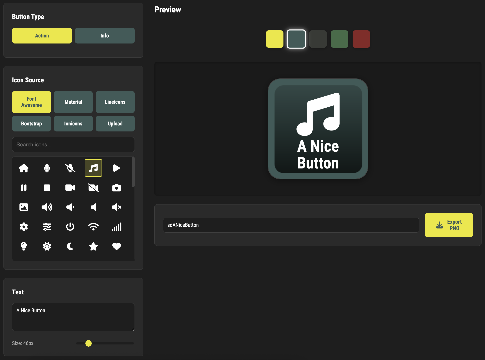

# Stream Deck Icon Generator

A web-based tool for creating consistent Stream Deck button icons.



## Features

- **Two Button Types**: Action and Info buttons with distinct gradient backgrounds
- **SVG Icon Library**: Search the full Font Awesome SVG set
- **Custom Uploads**: Upload your own PNG/SVG images
- **Multi-Color Preview**: See your icon on the 5 style guide colors
- **Transparent Export**: Download as PNG with alpha channel (no background color)
- **Real-time Preview**: All changes update instantly

## Preview Colors

The preview system shows your icon on these 5 colors from the color palette:
- Primary (Teal): `#3D5B58`
- Secondary (Gray): `#373A36`
- Positive (Green): `#406B47`
- Warning (Red): `#892626`
- Active (Yellow): `#ebe717`

## Usage

1. **Select Button Type**: Choose between Action or Info button backgrounds
2. **Choose an Icon**:
   - Browse Font Awesome or Material Symbols libraries
   - Search for icons by name
   - Or upload your own image
3. **Customize Icon**: Adjust the icon color using the color picker
4. **Add Text**: Enter text in the lower third of the button
5. **Customize Text**: Adjust size, color, and alignment
6. **Preview**: View your design on multiple background colors
7. **Export**: Download your transparent PNG icon

## Technical Details

- **Output Size**: 288x288 pixels
- **Icon Size**: 72x72 pixels (quarter of button size)
- **Text Area**: Lower third of the button (bottom 96px)
- **Export Format**: PNG with alpha channel (transparent background)

## Local Development

To run locally:

```bash
# From the project directory
python3 -m http.server 8000

# Then open in browser:
# http://localhost:8000
```

## GitHub Pages Deployment

1. Push this repository to GitHub
2. Go to repository Settings → Pages
3. Select source: `main` branch, root directory
4. Your site will be available at: `https://[username].github.io/sdIconGenerator/`

## Browser Compatibility

Requires modern browser support for:
- HTML5 Canvas API
- ES6 Modules
- CSS Grid
- Custom fonts (@font-face)

## Credits

- Font Awesome icons
- Google Material Symbols
- Roboto Condensed font by Google Fonts
- Inspired by [Button Designer by Adam Greenough](https://github.com/adamgreenough/button-designer)

## License

MIT
